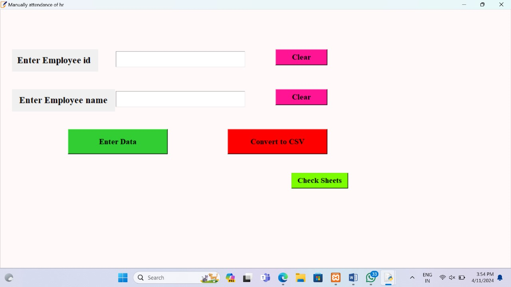

**CODE REQUIREMENTS**
1. Opencv(pip install opencv-python)
2. Tkinter(Available in python)
3. PIL (pip install Pillow)
4. Pandas(pip install pandas)

**WHAT STEPS YOU HAVE TO FOLLOW??**

1. Download my Repository
2. Create a TrainingImage folder in a project.
3. Open a AMS_Run.py and change the all paths with your system path
4. Run AMS_Run.py.

**PROJECT STRUCTURE**
1. After run you need to give your face data to system so enter your ID and name in box than click on Take Images button.
2. It will collect 200 images of your faces, it save a images in TrainingImage folder
3. After that we need to train a model(for train a model click on Train Image button.
4. It will take 5-10 minutes for training(for 10 person data).
5. After training click on Automatic Attendance ,it can fill attendace by your face using our trained model (model will save in TrainingImageLabel )
6. It will create .csv file of attendance according to time & subject.
7. You can store data in database (install wampserver),change the DB name according to your in AMS_Run.py.
8. Manually Fill Attendace Button in UI is for fill a manually attendance (without facce recognition),it's also create a .csv and store in a database.

**SCREENSCHOTS**

**BASIC UI**

**WHEN IT'S RECOGNISE ME**

**MANNUAL ATTENDANCE FILLIING IT**

**ADMIN VISIT**

